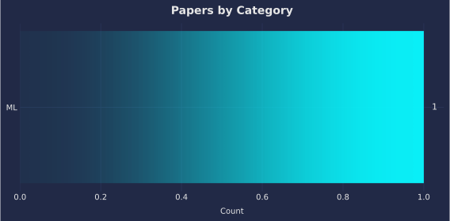
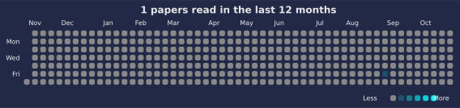

# 📚 Paper Reading Log

Track and visualize your paper reading with auto-updated charts.

<!--CHART_START-->





**Breakdown**

| Category | Count |
|---|---|
| LLM | 29 |
| TTS | 19 |
| Multimodal (T/S) | 18 |
| NAC | 11 |
| Dataset (Speech) | 4 |
| ML | 4 |
| ASR | 3 |
| Multimodal (T/I) | 3 |
| Speech | 3 |
| Multimodal (T/S/I/V) | 2 |
| VC | 2 |
| Audio | 1 |
| Multimodal (T/S/I) | 1 |
| ST | 1 |
| Text Embedding | 1 |
| THG | 1 |
| TTI | 1 |
| **Total** | **104** |

**Recently read**

- [Generative Annotation for ASR Named Entity Correction](https://www.arxiv.org/abs/2508.20700) — *ASR* (2025-09-05)
- [CLEAR: Continuous Latent Autoregressive Modeling for High-quality and Low-latency Speech Synthesis](https://arxiv.org/abs/2508.19098) — *TTS* (2025-09-04)
- [SpectroStream: A Versatile Neural Codec for General Audio](https://arxiv.org/abs/2508.05207) — *NAC* (2025-09-03)
- [FastVLM: Efficient Vision Encoding for Vision Language Models](https://arxiv.org/abs/2412.13303) — *Multimodal (T/I)* (2025-09-03)
- [OmniFlatten: An End-to-end GPT Model for Seamless Voice Conversation](https://arxiv.org/abs/2410.17799) — *Multimodal (T/S)* (2025-09-02)
- [rStar2-Agent: Agentic Reasoning Technical Report](https://arxiv.org/abs/2508.20722) — *LLM* (2025-09-02)
- [On the Theoretical Limitations of Embedding-Based Retrieval](https://arxiv.org/abs/2508.21038) — *Text Embedding* (2025-09-01)
- [TaDiCodec: Text-aware Diffusion Speech Tokenizer for Speech Language Modeling](https://arxiv.org/abs/2508.16790) — *NAC* (2025-08-31)
- [SimPO: Simple Preference Optimization with a Reference-Free Reward](https://arxiv.org/abs/2405.14734) — *LLM* (2025-08-30)
- [Prompt-Guided Turn-Taking Prediction](https://arxiv.org/abs/2506.21191) — *Speech* (2025-08-30)
<!--CHART_END-->

## How to add a new paper

Add paper info to `data/papers.yml` in the following format:

```yaml
- title: "Your paper title"
  category: "LLM"
  date: "YYYY-MM-DD"
  link: "https://..."
```

## Reuse This Repo

- Use as template: Click "Use this template" on GitHub, then edit `data/papers.yml`.
- Timezone: Set `PAPERS_TZ` in the workflow (default `Asia/Tokyo`).
- CI validation: The workflow validates `data/papers.yml` before building charts.
- Export: CI also writes a machine-readable `data/papers.json` for reuse.

See `TEMPLATE.md` for details.

## Development

With `uv` (recommended):

```
uv sync
uv run scripts/validate_papers.py
uv run scripts/build_readme.py
uv run scripts/export_json.py
```

## License

- Code: MIT (`LICENSE`)
- Content (notes, `data/papers.yml`, generated charts in `assets/`): CC BY 4.0 — https://creativecommons.org/licenses/by/4.0/
